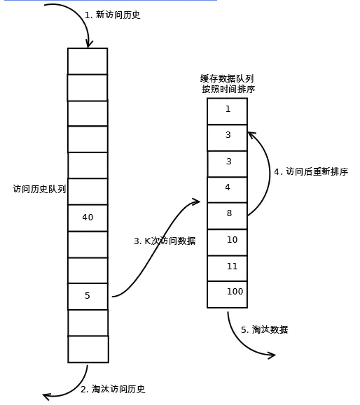

### LRU算法
LRU(Least recently used)最近最少使用算法，是一种常用的缓存淘汰算法，主要思想就是将最近最少使用的数据淘汰掉，保留最近使用过的数据。
当缓存满了的时候，需要选择一种策略将部分缓存淘汰掉，LRU的出发点就是淘汰掉最近最少使用的那部分缓存。

#### 实现思路一
最简单的思路就是为每个缓存数据添加一个时间戳，用来记录最近一次访问的时间，当缓存满了的时候，淘汰数据时遍历所有缓存数据，选择时间戳最老的那个淘汰掉。
想法简单，但性能太差。代码可见[lru_time](../src/lru_time.rs)。

#### 实现思路二
双向链表实现思路： 每当新插入或者访问数据，将数据放到链表头部，当数据满了的时候，从链表尾部删除数据。

#### 实现思路三
哈希表+双向链表实现。主要思路是在双向链表的实现基础上，增加一个哈希表，用于索引key，使得插入和删除的复杂度降低到O(1)。代码见[lru_double_list](../src/lru_double_list.rs)。
具体一点就是，哈希表的K可以认为是一个索引，V 是一个双向链表，每个V都有前驱节点和后驱节点的指针。其实这个思路和[linked-hash-map](https://github.com/contain-rs/linked-hash-map)的思路差不多。

### LRU算法优化
针对LRU算法的优化，一定是根据具体的业务需求去分析，作为缓存淘汰算法的实现之一，这里只是列出其中一个优化的思路。

#### LRU-K

设想这么一种情况，如果有大量的只访问一次的数据操作，比如，每次都新插入一个数据，但后面很长一段时间不再访问了，那么按照上面的实现，非热点数据会将热点数据挤出。针对这种情况，LRU-K算法将原先进入缓存队列的评判标准从访问一次改变为访问K次，上面的LRU算法可以认为是LRU-1。

LRU-K算法有两个队列，一个是缓存队列，一个是相对LRU新增的数据访问历史队列，当访问一个数据时，先在访问历史队列中累积访问次数，当访问次数超过K次后，才放入缓存队列，这样就能一定程度的避免非热点数据将热点数据挤出的情况。访问队列按照LRU的规则进行淘汰。

关于K取值多少的问题，K越大，一定程度上缓存命中率越高，但也会导致缓存难以被淘汰。

##### Two Queue
Two Queue在LRU-2的基础上，将数据访问历史改为FIFO队列。

#### 其他
还有一种优化是Multi Queue，就比较麻烦了, 可以看后面的参考资料。不论哪种缓存淘汰算法，核心一点就是要看业务数据访问的具体情况，设计出平衡命中率和性能的缓存淘汰算法。

---
> 参考资料：[LRU算法及其优化策略——算法篇](https://juejin.cn/post/6844904049263771662#heading-8)